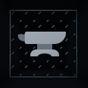

# Connected

Connected Block Textures unofficial Forge port.

**Require [ForgedAPI](https://github.com/PortingLab/ForgedAPI).**

An implementation of the MCPatcher/Optifine connected textures format.
